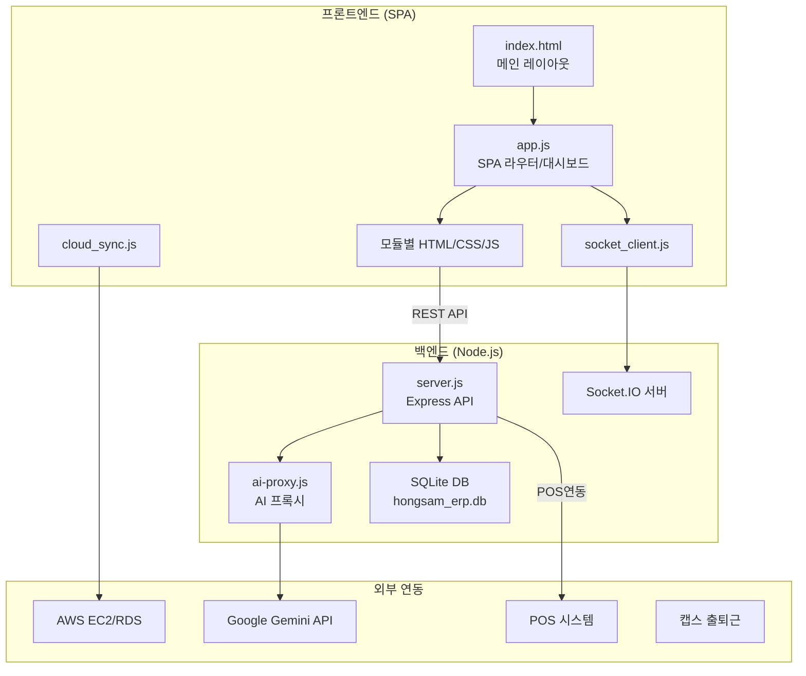
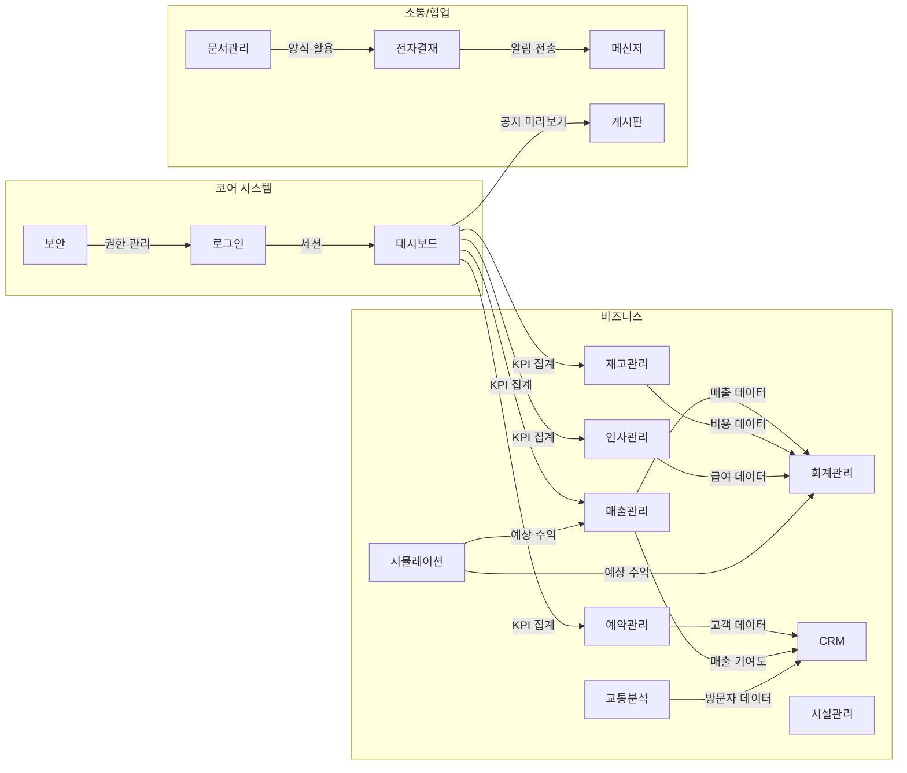

# 홍삼스파 ERP 시스템 — 전체 모듈 상세 설명서

> **프로젝트**: 홍삼스파 호텔/리조트 통합 ERP 시스템  
> **기술 스택**: 프론트엔드 순수 HTML/CSS/JS SPA + 백엔드 Node.js/Express + SQLite  
> **총 모듈 수**: 15개 (코어 5 + 비즈니스 9 + 소통/협업 4 + 기타)  
> **총 파일 수**: 약 100개 (소스코드 + 데이터 + 설정 + 배포 스크립트)

---

## 📐 시스템 아키텍처 개요



---

## 🏗️ Part 1: 코어 시스템 모듈

### 1.1 서버 — [server.js](file:///g:/다른 컴퓨터/노트북/Documents/HONGSAM SPA ERP/server.js) (약 1,282줄)

> [!IMPORTANT]
> 전체 ERP 시스템의 백엔드를 담당하는 핵심 파일. Express 기반 RESTful API 서버.

#### 목적
인증, 세션관리, DB(SQLite), 파일 업로드, 실시간 Socket.IO 통신 등 전체 백엔드 로직 담당.

#### 사용 패키지

| 패키지 | 용도 |
|---|---|
| `express` | HTTP 서버 프레임워크 |
| `better-sqlite3` | SQLite3 데이터베이스 드라이버 |
| `bcrypt` | 비밀번호 해싱 |
| `cors` | 크로스-오리진 허용 |
| `express-session` | 세션 관리 |
| `multer` | 파일 업로드 처리 |
| `socket.io` | 실시간 양방향 통신 |

#### 데이터베이스 구조 (SQLite)
`hongsam_erp.db` 파일 기반, WAL 모드 사용(동시성 향상). 약 **25개 테이블**:

| 테이블 그룹 | 테이블명 |
|---|---|
| 인증/사용자 | `users` |
| 인사관리 | `employees`, `salary_records` |
| 영업관리 | `reservations`, `sales` |
| 재고/회계 | `inventory`, `suppliers`, `accounting` |
| 결재 | `approval_documents` |
| 소통 | `board_posts`, `board_comments`, `messages`, `documents` |
| 운영 | `facilities`, `traffic`, `simulations` |
| CRM | `crm_customers`, `crm_interactions`, `crm_tasks`, `crm_surveys` |
| 시스템 | `notifications`, `read_receipts` |

#### REST API 엔드포인트 (전체 목록)

| 영역 | 엔드포인트 | 메서드 |
|---|---|---|
| **인증** | `/api/login` | POST |
| | `/api/logout` | POST |
| | `/api/session` | GET |
| | `/api/check-auth` | GET |
| | `/api/change-password` | POST |
| **인사** | `/api/employees` | GET, POST |
| | `/api/employees/:id` | PUT, DELETE |
| | `/api/employees/upload-photo/:id` | POST |
| | `/api/salary-records` | GET, POST |
| | `/api/departments` | GET, POST, DELETE |
| | `/api/positions` | GET, POST, DELETE |
| **예약** | `/api/reservations` | GET, POST |
| | `/api/reservations/:id` | PUT, DELETE |
| **매출** | `/api/sales` | GET, POST |
| | `/api/sales/:id` | PUT, DELETE |
| | `/api/sales/summary` | GET |
| **재고** | `/api/inventory` | GET, POST |
| | `/api/inventory/:id` | PUT, DELETE |
| | `/api/suppliers` | GET, POST, PUT, DELETE |
| **회계** | `/api/accounting` | GET, POST |
| | `/api/accounting/:id` | PUT, DELETE |
| | `/api/accounting/summary` | GET |
| | `/api/accounting/budget` | GET |
| **결재** | `/api/approval` | GET, POST |
| | `/api/approval/:id/status` | PUT |
| | `/api/approval/:id` | DELETE |
| **게시판** | `/api/board` | GET, POST |
| | `/api/board/:id` | GET, PUT, DELETE |
| | `/api/board/:id/comments` | GET, POST |
| | `/api/board/comments/:id` | DELETE |
| **메신저** | `/api/messages` | GET, POST |
| | `/api/messages/:id/read` | PUT |
| | `/api/messages/unread-count` | GET |
| **문서** | `/api/documents` | GET, POST |
| | `/api/documents/:id` | PUT, DELETE |
| **시설** | `/api/facilities` | GET, POST |
| | `/api/facilities/:id` | PUT, DELETE |
| **교통** | `/api/traffic` | GET, POST |
| | `/api/traffic/:id` | PUT, DELETE |
| **시뮬레이션** | `/api/simulations` | GET, POST |
| | `/api/simulations/:id` | DELETE |
| **CRM** | `/api/crm/customers` | GET, POST |
| | `/api/crm/customers/:id` | PUT, DELETE |
| | `/api/crm/interactions` | GET, POST |
| | `/api/crm/tasks` | GET, POST |
| | `/api/crm/surveys` | GET, POST |
| **알림** | `/api/notifications/:userId` | GET |
| | `/api/notifications` | POST |
| | `/api/notifications/:id/read` | PUT |
| **사용자** | `/api/users` | GET, POST |
| | `/api/users/:id` | PUT, DELETE |

#### Socket.IO 이벤트

| 이벤트 | 방향 | 설명 |
|---|---|---|
| `connection` | 서버←클라이언트 | 클라이언트 접속 |
| `join-room` | 서버←클라이언트 | 채팅방 입장 |
| `leave-room` | 서버←클라이언트 | 채팅방 퇴장 |
| `send-message` | 양방향 | 메시지 전송 (DB 저장 + 브로드캐스트) |
| `typing` | 양방향 | 타이핑 표시 |
| `disconnect` | 서버←클라이언트 | 접속 해제 |

---

### 1.2 메인 SPA 앱 — [app.js](file:///g:/다른 컴퓨터/노트북/Documents/HONGSAM SPA ERP/app.js) (약 1,312줄)

#### 목적
프론트엔드 SPA의 핵심 로직. 라우팅, 모듈 동적 로딩, 대시보드, 네비게이션, 알림, 사용자 관리.

#### 핵심 기능

| 기능 | 설명 |
|---|---|
| **API_BASE 자동선택** | 로컬(`localhost:3000`) 또는 AWS(`13.125.202.35:3000`) 자동 감지 |
| **SPA 라우팅** | `loadModule(name)`로 모듈별 HTML을 fetch → `#content-area`에 동적 삽입 |
| **CSS 동적로드** | `loadModuleCSS(file)`로 모듈별 CSS를 `<link>` 태그로 동적 삽입 |
| **대시보드** | KPI 카드(매출, 예약, 직원, 재고) + Chart.js 매출 추이 차트 |
| **사이드바** | 아코디언 2단계 메뉴, 접기/펼치기 토글 |
| **알림 시스템** | 서버에서 알림 조회, 드롭다운 팝업, 안읽은 수 뱃지 |
| **사용자 프로필** | 비밀번호 변경, 로그아웃 |

#### 유틸리티 함수

| 함수 | 용도 |
|---|---|
| `formatCurrency(amount)` | 한국 원화 포맷 (₩1,234,567) |
| `formatDate(date)` | 날짜 포맷 (YYYY-MM-DD) |
| `showToast(message, type)` | 토스트 알림 (success/error/warning/info) |
| `showConfirm(message)` | 확인 다이얼로그 |
| `escapeHTML(str)` | XSS 방지 HTML 이스케이프 |

---

### 1.3 메인 레이아웃 — [index.html](file:///g:/다른 컴퓨터/노트북/Documents/HONGSAM SPA ERP/index.html) (약 620줄)

#### 구조

```
┌─────────────────────────────────────────────────┐
│                   헤더 (#header)                  │
│  [☰] [검색바]          [🔔 알림] [👤 사용자 ▼]  │
├──────────┬──────────────────────────────────────┤
│ 사이드바  │                                      │
│ (#sidebar)│     콘텐츠 영역 (#content-area)        │
│           │                                      │
│ 📊 대시보드│     ┌─────┐ ┌─────┐ ┌─────┐ ┌─────┐  │
│ 👥 인사관리│     │매출  │ │예약  │ │직원  │ │재고  │  │
│ 💰 영업관리│     │KPI  │ │KPI  │ │KPI  │ │KPI  │  │
│ 📈 재무관리│     └─────┘ └─────┘ └─────┘ └─────┘  │
│ 🏢 운영관리│     ┌──────────────────────────────┐  │
│ 💬 소통협업│     │     매출 추이 차트 (Chart.js)  │  │
│ ⚙️ 시스템 │     └──────────────────────────────┘  │
│           │     ┌──────┐ ┌──────┐ ┌──────┐       │
│ [접기 ◀]  │     │최근   │ │오늘   │ │공지  │       │
│           │     │활동   │ │일정   │ │사항  │       │
└──────────┴─────┴──────┘─┴──────┘─┴──────┘───────┘
```

#### 외부 라이브러리
- **Google Fonts**: Noto Sans KR
- **Font Awesome**: 아이콘 시스템
- **Chart.js**: 차트 시각화
- **Socket.IO Client**: 실시간 통신

---

### 1.4 메인 스타일시트 — [style.css](file:///g:/다른 컴퓨터/노트북/Documents/HONGSAM SPA ERP/style.css) (약 564줄)

#### 디자인 시스템 (CSS 변수)

| 변수 | 값 | 용도 |
|---|---|---|
| `--primary` | `#2c5f2d` (진한 녹색) | 주요 브랜드 색상 |
| `--primary-light` | `#4a8b4c` | 밝은 녹색 |
| `--primary-dark` | `#1a3e1c` | 어두운 녹색 |
| `--secondary` | `#97bc62` (연두색) | 보조 색상 |
| `--accent` | `#d4a543` (골드) | 강조 색상 |
| `--bg-dark` | `#1a1a2e` (진한 남색) | 사이드바 배경 |
| `--bg-light` | `#f0f2f5` | 콘텐츠 배경 |

> [!NOTE]
> 홍삼(인삼) 테마에 맞는 **녹색-골드 컬러 팔레트** 사용. 자연/건강 이미지를 반영한 디자인.

#### 레이아웃 구조
- 사이드바: 고정 좌측 260px, 다크 배경
- 헤더: 고정 상단 60px
- 콘텐츠: 좌측 마진 260px, 상단 마진 60px
- 반응형 브레이크포인트: 1024px, 768px

---

### 1.5 로그인 모듈

| 파일 | 줄수 | 설명 |
|---|---|---|
| [login.html](file:///g:/다른 컴퓨터/노트북/Documents/HONGSAM SPA ERP/login.html) | ~96줄 | 로그인 페이지 (독립 페이지) |
| [login.css](file:///g:/다른 컴퓨터/노트북/Documents/HONGSAM SPA ERP/login.css) | ~180줄 | 글래스모피즘 로그인 카드 스타일 |
| [login.js](file:///g:/다른 컴퓨터/노트북/Documents/HONGSAM SPA ERP/login.js) | ~250줄 | 인증 로직, 세션 관리 |

#### 주요 기능
- **디자인**: 그라데이션 배경(진한 녹색 → 남색), 반투명 카드(backdrop-filter blur 글래스모피즘)
- **인증**: bcrypt 비밀번호 비교, 세션 기반 인증
- **UX**: Enter 키 로그인, 로딩 스피너, shake 애니메이션(에러 시), 아이디 기억(Remember me)
- **API**: `POST /api/login` → 성공 시 `index.html`로 이동

---

### 1.6 보안 모듈

| 파일 | 줄수 | 설명 |
|---|---|---|
| [security.html](file:///g:/다른 컴퓨터/노트북/Documents/HONGSAM SPA ERP/security.html) | ~260줄 | 보안 설정 UI |
| [security.css](file:///g:/다른 컴퓨터/노트북/Documents/HONGSAM SPA ERP/security.css) | ~120줄 | 보안 탭/테이블 스타일 |
| [security.js](file:///g:/다른 컴퓨터/노트북/Documents/HONGSAM SPA ERP/security.js) | ~181줄 | 사용자/권한/감사 관리 로직 |

#### 4개 탭 구성

| 탭 | 기능 |
|---|---|
| **사용자 관리** | 사용자 목록, 추가/수정/삭제, 활성/비활성 토글 |
| **접근 권한** | 모듈별 권한 매트릭스 (관리자/부서장/일반별 읽기/쓰기/삭제) |
| **감사 로그** | 시스템 활동 로그 (시간, 사용자, 활동, IP) |
| **보안 설정** | 비밀번호 정책, 세션 타임아웃, IP 차단 |

---

### 1.7 클라우드 동기화 — [cloud_sync.js](file:///g:/다른 컴퓨터/노트북/Documents/HONGSAM SPA ERP/cloud_sync.js) (약 132줄)

#### 목적
로컬 서버와 AWS 클라우드 서버 간 데이터 동기화.

#### CloudSync 클래스

| 메서드 | 설명 |
|---|---|
| `startAutoSync()` | 5분 간격 자동 동기화 시작 |
| `stopAutoSync()` | 자동 동기화 중지 |
| `syncAll()` | 전체 모듈 일괄 동기화 |
| `syncModule(name)` | 개별 모듈 동기화 |
| `uploadToCloud(endpoint, data)` | 로컬 → 클라우드 업로드 |
| `downloadFromCloud(endpoint)` | 클라우드 → 로컬 다운로드 |
| `resolveConflicts(local, cloud)` | 충돌 해결 (최신 수정일 기준) |

---

### 1.8 소켓 클라이언트 — [socket_client.js](file:///g:/다른 컴퓨터/노트북/Documents/HONGSAM SPA ERP/socket_client.js) (약 83줄)

#### SocketClient 클래스

| 메서드 | 설명 |
|---|---|
| `connect()` | Socket.IO 서버 연결 |
| `disconnect()` | 연결 해제 |
| `joinRoom(roomId)` | 채팅방 입장 |
| `leaveRoom(roomId)` | 채팅방 퇴장 |
| `sendMessage(roomId, msg)` | 메시지 전송 |
| `onMessage(callback)` | 메시지 수신 콜백 |
| `onTyping(callback)` | 타이핑 상태 콜백 |
| `onNotification(callback)` | 알림 수신 콜백 |

---

### 1.9 AI 통합

| 파일 | 설명 |
|---|---|
| [ai-config.js](file:///g:/다른 컴퓨터/노트북/Documents/HONGSAM SPA ERP/ai-config.js) | Google Gemini API 키 및 모델(`gemini-pro`) 설정 |
| [ai-proxy.js](file:///g:/다른 컴퓨터/노트북/Documents/HONGSAM SPA ERP/ai-proxy.js) | AI API 프록시 서버 (채팅/데이터분석 엔드포인트) |

#### AI 엔드포인트

| 엔드포인트 | 용도 |
|---|---|
| `POST /api/ai/chat` | AI 대화 (프롬프트 → Gemini 응답) |
| `POST /api/ai/analyze` | ERP 데이터 분석 (매출/예약 등) |

---

## 💼 Part 2: 비즈니스 모듈

### 2.1 인사관리 모듈 (HR)

| 파일 | 줄수 |
|---|---|
| [hr.html](file:///g:/다른 컴퓨터/노트북/Documents/HONGSAM SPA ERP/hr.html) | ~1,540줄 |
| [hr.css](file:///g:/다른 컴퓨터/노트북/Documents/HONGSAM SPA ERP/hr.css) | ~600줄 |
| [hr.js](file:///g:/다른 컴퓨터/노트북/Documents/HONGSAM SPA ERP/hr.js) | ~2,000줄 |
| [hr_excel.js](file:///g:/다른 컴퓨터/노트북/Documents/HONGSAM SPA ERP/hr_excel.js) | ~580줄 |

#### 6개 탭 구성

````carousel
### 📋 직원관리 탭
- 검색/필터(이름, 부서, 상태)
- 직원 목록 테이블 (사진, 이름, 부서, 직급, 입사일, 연락처, 상태)
- 직원 상세 보기 모달
- 직원 추가/수정 모달 (기본정보, 재직정보, 급여정보, 학력, 경력, 자격증, 가족관계)
- 직원 사진 업로드 (multer)
- 상태 뱃지: 재직(초록), 퇴직(빨강), 휴직(노랑)
<!-- slide -->
### 💰 급여관리 탭
- 급여 현황 요약 카드 (총 급여, 평균, 최대/최소)
- 월별 급여 테이블 (기본급, 수당, 공제, 실수령액)
- 급여 명세서 인쇄 기능
- 급여 일괄 업로드 (Excel)
- 자동 계산: 기본급 + 수당 - 공제 = 실수령액
<!-- slide -->
### ⏰ 근태관리 탭
- 출퇴근 기록 테이블 (날짜, 출근/퇴근시간, 근무시간, 상태)
- 연차/휴가 관리
- 월별 근태 통계 차트
- 캡스 출퇴근 기록 XLS 가져오기 지원
<!-- slide -->
### 📝 인사기록 탭
- 인사 이력 목록 (승진, 부서이동, 징계, 포상)
- 인사기록 추가 모달
<!-- slide -->
### 🏛️ 조직도 탭
- 트리 형태 조직도 (부서 → 직급 → 직원)
- 노드 클릭 시 직원 상세 표시
<!-- slide -->
### ⚙️ 부서/직급관리 탭
- 부서 목록 (부서명, 코드, 인원수)
- 직급 목록 (직급명, 코드, 순서)
- 부서/직급 추가/삭제
````

#### HR Excel 매니저 (hr_excel.js)

| 메서드 | 설명 |
|---|---|
| `exportEmployeeList()` | 직원 목록 Excel 내보내기 |
| `exportSalaryReport(year, month)` | 월별 급여 보고서 Excel 생성 |
| `importEmployeeData(file)` | Excel → 직원 일괄 가져오기 |
| `importSalaryData(file)` | 급여대장 XLS 가져오기 |
| `importAttendanceData(file)` | 캡스 출퇴근 기록 가져오기 |

---

### 2.2 매출관리 모듈 (Sales)

| 파일 | 줄수 |
|---|---|
| [sales.html](file:///g:/다른 컴퓨터/노트북/Documents/HONGSAM SPA ERP/sales.html) | ~880줄 |
| [sales.css](file:///g:/다른 컴퓨터/노트북/Documents/HONGSAM SPA ERP/sales.css) | ~640줄 |
| [sales.js](file:///g:/다른 컴퓨터/노트북/Documents/HONGSAM SPA ERP/sales.js) | ~1,400줄 |

#### 4개 탭 구성

| 탭 | 주요 기능 |
|---|---|
| **매출현황** | 기간 필터, 요약 카드(총매출/객실/식음/스파/기타), 매출 목록 테이블, 매출 추이 차트 |
| **매출등록** | 매출 입력 폼(날짜, 카테고리, 항목, 금액, 결제방법, 담당자), 일괄 등록 |
| **매출분석** | 기간별 비교, 카테고리별 파이차트, 결제방법별 분석, 일평균/최대/최소 통계 |
| **POS연동** | POS 연결 상태, 수동 데이터 가져오기, 카테고리 매핑 설정 |

#### 매출 카테고리
- 객실 매출 / 식음 매출 / 스파 매출 / 기타 매출

#### 결제방법
- 현금 / 카드 / 계좌이체

#### Chart.js 차트
- 매출 추이 라인차트 (월별)
- 카테고리별 파이/도넛 차트
- 결제방법별 차트
- 기간별 비교 차트

---

### 2.3 회계관리 모듈 (Accounting)

| 파일 | 줄수 |
|---|---|
| [accounting.html](file:///g:/다른 컴퓨터/노트북/Documents/HONGSAM SPA ERP/accounting.html) | ~1,280줄 |
| [accounting.css](file:///g:/다른 컴퓨터/노트북/Documents/HONGSAM SPA ERP/accounting.css) | ~740줄 |
| [accounting.js](file:///g:/다른 컴퓨터/노트북/Documents/HONGSAM SPA ERP/accounting.js) | ~1,900줄 |

#### 5개 탭 구성

| 탭 | 주요 기능 |
|---|---|
| **전표관리** | 전표 CRUD, 검색/필터(기간/유형/계정과목), 전표번호 자동채번, 승인/반려 |
| **손익계산서** | 기간별 자동 생성, 매출액→매출원가→매출총이익→판관비→영업이익→당기순이익 |
| **예산관리** | 부서별 예산 배정, 예산 대비 실적 비교, 초과 경고 알림 |
| **자금현황** | 은행 계좌별 잔액, 입출금 내역, 현금흐름표, 자금 흐름 차트 |
| **세금관리** | 부가가치세 신고, 원천세, 세금계산서 발행 |

#### 계정과목 체계
- 표준 계정과목 코드(자산/부채/자본/수익/비용) 내장
- 계정과목 드롭다운 자동 구성

---

### 2.4 재고관리 모듈 (Inventory)

| 파일 | 줄수 |
|---|---|
| [inventory.html](file:///g:/다른 컴퓨터/노트북/Documents/HONGSAM SPA ERP/inventory.html) | ~1,480줄 |
| [inventory.css](file:///g:/다른 컴퓨터/노트북/Documents/HONGSAM SPA ERP/inventory.css) | ~230줄 |
| [inventory.js](file:///g:/다른 컴퓨터/노트북/Documents/HONGSAM SPA ERP/inventory.js) | ~760줄 |

#### 5개 탭 구성

| 탭 | 주요 기능 |
|---|---|
| **품목관리** | 품목 CRUD, 카테고리(식재료/음료/소모품/비품/스파용품/객실용품), CSV 일괄 업로드 |
| **입출고** | 입고/출고 등록, 수량 자동 증감, 입출고 내역 테이블+차트 |
| **거래처** | 거래처 CRUD, CSV 일괄 업로드 |
| **재고현황** | 요약 카드(총 품목/부족 품목/총 가치), 카테고리별 차트, 부족 경고, ABC 분석 |
| **발주관리** | 자동 발주 추천(최소수량 이하), 발주서 작성, 발주 이력 |

#### 파일 템플릿
- [재고_품목등록_일괄업로드양식.csv](file:///g:/다른 컴퓨터/노트북/Documents/HONGSAM SPA ERP/재고_품목등록_일괄업로드양식.csv)
- [재고_거래처현황_일괄업로드양식.csv](file:///g:/다른 컴퓨터/노트북/Documents/HONGSAM SPA ERP/재고_거래처현황_일괄업로드양식.csv)

---

### 2.5 예약관리 모듈 (Reservation)

| 파일 | 줄수 |
|---|---|
| [reservation.html](file:///g:/다른 컴퓨터/노트북/Documents/HONGSAM SPA ERP/reservation.html) | ~540줄 |
| [reservation.css](file:///g:/다른 컴퓨터/노트북/Documents/HONGSAM SPA ERP/reservation.css) | ~380줄 |
| [reservation.js](file:///g:/다른 컴퓨터/노트북/Documents/HONGSAM SPA ERP/reservation.js) | ~560줄 |

#### 4개 탭 구성

| 탭 | 주요 기능 |
|---|---|
| **예약현황** | 월별 캘린더(날짜별 예약 건수 뱃지), 예약 목록 테이블, 상태 필터(전체/확정/대기/취소) |
| **예약등록** | 고객명, 연락처, 객실유형, 체크인/아웃, 인원, 요금 자동 계산 |
| **객실현황** | 객실 상태 보드(빈방/입실/청소중/점검중), 층별/유형별 그리드 |
| **예약통계** | 월별 예약률 차트, 객실유형별 분포, 평균 투숙일/요금 |

#### 객실 요금 체계

| 객실 유형 | 1박 단가 |
|---|---|
| 스탠다드 | ₩80,000 |
| 디럭스 | ₩120,000 |
| 스위트 | ₩200,000 |
| VIP | ₩350,000 |

> 주말 할증 적용, 박수 × 단가 자동 계산

---

### 2.6 CRM 모듈

| 파일 | 줄수 |
|---|---|
| [crm.html](file:///g:/다른 컴퓨터/노트북/Documents/HONGSAM SPA ERP/crm.html) | ~660줄 |
| [crm.css](file:///g:/다른 컴퓨터/노트북/Documents/HONGSAM SPA ERP/crm.css) | ~90줄 |
| [crm.js](file:///g:/다른 컴퓨터/노트북/Documents/HONGSAM SPA ERP/crm.js) | ~560줄 |

#### 5개 탭 구성

| 탭 | 주요 기능 |
|---|---|
| **고객관리** | 고객 CRUD, 등급(VIP/Gold/Silver/일반), 방문횟수, 총매출, 상세 모달 |
| **상호작용** | 고객 상호작용 타임라인(전화/이메일/방문/컴플레인), 기록 등록 |
| **태스크** | CRM 업무 목록(연락, 팔로업 등), 상태 관리(대기/진행/완료) |
| **설문조사** | 설문 생성/관리, 만족도 분석 차트 |
| **고객분석** | 등급별 분포 차트, 방문 빈도, 매출 기여도, RFM 분석 |

#### 고객 등급 체계
- **VIP** (골드 뱃지) → **Gold** (노랑 뱃지) → **Silver** (회색 뱃지) → **일반**

---

### 2.7 시설관리 모듈 (Facility)

| 파일 | 줄수 |
|---|---|
| [facility.html](file:///g:/다른 컴퓨터/노트북/Documents/HONGSAM SPA ERP/facility.html) | ~480줄 |
| [facility.css](file:///g:/다른 컴퓨터/노트북/Documents/HONGSAM SPA ERP/facility.css) | ~420줄 |
| [facility.js](file:///g:/다른 컴퓨터/노트북/Documents/HONGSAM SPA ERP/facility.js) | ~620줄 |

#### 4개 탭 구성

| 탭 | 주요 기능 |
|---|---|
| **시설현황** | 시설 카드(시설명/위치/상태/최근점검일/담당자), 카테고리 필터(건물/설비/전기/배관/HVAC) |
| **점검/정비** | 정기점검 캘린더, 점검 이력, 정비 요청(긴급/일반), 점검 등록 모달 |
| **에너지관리** | 에너지 사용량 차트(전기/가스/수도/난방), 월별 비용 비교, 절감 목표 대비 실적, IoT 센서 연동 대비 |
| **안전관리** | 안전점검 체크리스트, 소방 설비 점검, 안전사고 보고서, 안전교육 이수 현황 |

---

### 2.8 교통분석 모듈 (Traffic)

| 파일 | 줄수 |
|---|---|
| [traffic.html](file:///g:/다른 컴퓨터/노트북/Documents/HONGSAM SPA ERP/traffic.html) | ~380줄 |
| [traffic.css](file:///g:/다른 컴퓨터/노트북/Documents/HONGSAM SPA ERP/traffic.css) | ~440줄 |
| [traffic.js](file:///g:/다른 컴퓨터/노트북/Documents/HONGSAM SPA ERP/traffic.js) | ~580줄 |

#### 4개 탭 구성

| 탭 | 주요 기능 |
|---|---|
| **방문자현황** | 실시간 방문자 카운터, 시간대별 추이 차트, 일/주/월별 통계, 수동 입력 |
| **교통분석** | 교통량 시계열, 요일별 히트맵, 출발지 분석, 교통수단 분포(자차/대중교통/셔틀/도보) |
| **주차관리** | 주차장 현황 보드(총면/사용 중/빈 자리), 구역별 사용률, 주차 이력 |
| **셔틀운영** | 셔틀 노선/시간표, 이용자 수 통계, 운행 일지 |

---

### 2.9 시뮬레이션 모듈 (Simulation)

| 파일 | 줄수 |
|---|---|
| [simulation.html](file:///g:/다른 컴퓨터/노트북/Documents/HONGSAM SPA ERP/simulation.html) | ~15줄 |
| [simulation.css](file:///g:/다른 컴퓨터/노트북/Documents/HONGSAM SPA ERP/simulation.css) | ~410줄 |
| [simulation.js](file:///g:/다른 컴퓨터/노트북/Documents/HONGSAM SPA ERP/simulation.js) | ~220줄 |

#### 주요 기능
- **수익 시뮬레이션 엔진**: 슬라이더로 매개변수 조절
  - 객실 가동률, 평균 객실 단가, 식음 매출 비율, 스파 매출 비율, 운영비용률, 인건비률
- **시나리오 분석**: 시나리오 저장/불러오기/비교
- **결과 표시**: 예상 매출, 비용, 이익, 손익분기점 계산
- **모델**: 호텔 운영 수익 모델 (객실매출 + 식음매출 + 스파매출 - 운영비 - 인건비 - 기타비용)

> [!TIP]
> HTML은 15줄로 매우 간결하며, 전체 UI를 JS에서 동적으로 생성하는 방식을 사용합니다.

---

## 💬 Part 3: 소통/협업 모듈

### 3.1 메신저 모듈 (Messenger)

| 파일 | 줄수 |
|---|---|
| [messenger.html](file:///g:/다른 컴퓨터/노트북/Documents/HONGSAM SPA ERP/messenger.html) | ~310줄 |
| [messenger.css](file:///g:/다른 컴퓨터/노트북/Documents/HONGSAM SPA ERP/messenger.css) | ~570줄 |
| [messenger.js](file:///g:/다른 컴퓨터/노트북/Documents/HONGSAM SPA ERP/messenger.js) | ~1,030줄 |

#### 3열 레이아웃

```
┌──────────┬──────────────────────┬──────────┐
│ 채팅 목록  │     채팅 영역         │ 정보     │
│          │                      │          │
│ 🔍 검색   │ 홍길동 (온라인 🟢)    │ 참여자:  │
│          │ ────────────────     │ - 홍길동  │
│ 💬 홍길동  │ [받은 메시지]         │ - 김영희  │
│ 💬 김영희  │          [보낸 메시지] │          │
│ 👥 팀채팅  │ [받은 메시지]         │ 📎 파일:  │
│          │          [보낸 메시지] │ - doc.pdf│
│ [+ 새채팅] │ ────────────────     │          │
│ [+ 그룹]  │ ○○님이 입력 중...     │          │
│          │ [메시지 입력] [📎][😊][➤]│          │
└──────────┴──────────────────────┴──────────┘
```

#### 주요 기능

| 기능 | 설명 |
|---|---|
| **1:1 / 그룹 채팅** | 채팅방 생성, 참여자 관리 |
| **실시간 메시지** | Socket.IO 기반 실시간 송수신 |
| **읽음 확인** | 메시지 읽음/안읽음 표시, 안읽은 수 뱃지 |
| **타이핑 표시** | "○○님이 입력 중..." 애니메이션 (점 3개 깜빡임) |
| **파일 첨부** | 파일 업로드(multer), 이미지 미리보기 |
| **이모지** | 이모지 선택기 토글, 삽입 |
| **온라인 상태** | 초록 점 표시 |
| **데스크톱 알림** | 새 메시지 토스트/알림 |

---

### 3.2 게시판 모듈 (Board)

| 파일 | 줄수 |
|---|---|
| [board.html](file:///g:/다른 컴퓨터/노트북/Documents/HONGSAM SPA ERP/board.html) | ~330줄 |
| [board.css](file:///g:/다른 컴퓨터/노트북/Documents/HONGSAM SPA ERP/board.css) | ~280줄 |
| [board.js](file:///g:/다른 컴퓨터/노트북/Documents/HONGSAM SPA ERP/board.js) | ~610줄 |

#### 기능 구성

| 기능 | 설명 |
|---|---|
| **카테고리** | 전체글, 공지사항, 자유게시판, 업무게시판, 내 글 |
| **게시글 CRUD** | 제목, 내용, 카테고리, 파일 첨부, 공지 고정(관리자만) |
| **댓글** | 댓글 목록, 추가, 삭제 |
| **조회수** | 게시글 조회 시 자동 증가 |
| **검색/필터** | 제목/내용 검색, 카테고리 필터 |
| **페이지네이션** | 페이지 버튼 자동 생성 |
| **권한 체크** | 공지 작성: 관리자/부서장만, 수정/삭제: 작성자/관리자만 |
| **3가지 뷰** | 목록 뷰 ↔ 상세 뷰 ↔ 글쓰기/수정 폼 전환 |

---

### 3.3 문서관리 모듈 (Document)

| 파일 | 줄수 |
|---|---|
| [document.html](file:///g:/다른 컴퓨터/노트북/Documents/HONGSAM SPA ERP/document.html) | ~480줄 |
| [document.css](file:///g:/다른 컴퓨터/노트북/Documents/HONGSAM SPA ERP/document.css) | ~340줄 |
| [document.js](file:///g:/다른 컴퓨터/노트북/Documents/HONGSAM SPA ERP/document.js) | ~660줄 |
| [document_data.js](file:///g:/다른 컴퓨터/노트북/Documents/HONGSAM SPA ERP/document_data.js) | ~520줄 |

#### 3개 탭 구성

| 탭 | 주요 기능 |
|---|---|
| **문서함** | 문서 검색/필터, 목록 테이블(번호/제목/유형/작성자/날짜/상태), 상세 보기 모달 |
| **양식관리** | 양식 카테고리별 카드 그리드, 미리보기, 양식 추가 |
| **문서작성** | 양식 선택 → 동적 폼/에디터 → 미리보기 → 저장/제출 |

#### 문서 양식 (document_data.js) — 총 16종

| 카테고리 | 양식명 |
|---|---|
| **인사 양식** | 재직증명서, 경력증명서, 퇴직원, 시말서, 사유서, 휴가신청서, 출장신청서 |
| **경영 양식** | 업무보고서, 회의록, 기안서, 시행문 |
| **회계 양식** | 지출결의서, 세금계산서, 견적서 |
| **일반 양식** | 품의서, 서약서, 위임장 |

> 각 양식은 인쇄 최적화 테이블 레이아웃, 회사 로고, 직인 위치 포함.

---

### 3.4 전자결재 모듈 (Approval)

| 파일 | 줄수 |
|---|---|
| [approval.html](file:///g:/다른 컴퓨터/노트북/Documents/HONGSAM SPA ERP/approval.html) | ~470줄 |
| [approval.css](file:///g:/다른 컴퓨터/노트북/Documents/HONGSAM SPA ERP/approval.css) | ~380줄 |
| [approval.js](file:///g:/다른 컴퓨터/노트북/Documents/HONGSAM SPA ERP/approval.js) | ~830줄 |

#### 5개 탭 구성

| 탭 | 주요 기능 |
|---|---|
| **결재대기** | 결재 대기 문서 목록, 일괄 승인/반려, 긴급 표시 |
| **결재진행** | 내가 기안한 진행 중 문서, 단계별 진행 상태 |
| **결재완료** | 완료 문서(승인/반려 구분), 기간 검색 |
| **기안하기** | 결재유형 선택, 내용 작성, 결재라인 설정, 파일 첨부, 기안 제출 |
| **반려함** | 반려 문서(사유 표시), 재기안 기능 |

#### 결재 라인 시각화

```
┌──────┐    ┌──────┐    ┌──────┐
│ 기안자 │ → │ 부서장 │ → │ 본부장 │ → 대표
│  ✅   │    │  ⏳   │    │  ⭕   │
│ 승인  │    │ 대기  │    │ 미도달 │
└──────┘    └──────┘    └──────┘
```

#### 결재 유형
- 휴가신청, 지출결의, 업무보고, 기안, 품의, 기타

---

## 🛠️ Part 4: 공통/유틸리티

### 4.1 모바일 반응형 — [mobile.css](file:///g:/다른 컴퓨터/노트북/Documents/HONGSAM SPA ERP/mobile.css) (약 150줄)

| 브레이크포인트 | 변경 사항 |
|---|---|
| **768px 이하** | 사이드바 숨김(off-canvas), 콘텐츠 전체 너비, 헤더 간소화, 테이블 가로 스크롤, 모달 전체화면, 폼 1열 |
| **480px 이하** | KPI 카드 1열, 글씨 크기 조정 |

### 4.2 인쇄 스타일 — [print.css](file:///g:/다른 컴퓨터/노트북/Documents/HONGSAM SPA ERP/print.css) (약 260줄)

- 사이드바/헤더/네비게이션/버튼 숨김
- A4 용지 최적화 (`@page { size: A4 }`)
- 테이블 헤더 반복, 페이지 나눔 설정
- 급여명세서 전용 레이아웃
- Chart.js 캔버스 인쇄 지원

### 4.3 배포 스크립트

| 파일 | 설명 |
|---|---|
| [auto_deploy.bat](file:///g:/다른 컴퓨터/노트북/Documents/HONGSAM SPA ERP/auto_deploy.bat) | Windows 배포 스크립트 |
| [auto_deploy.sh](file:///g:/다른 컴퓨터/노트북/Documents/HONGSAM SPA ERP/auto_deploy.sh) | Linux/AWS 배포 스크립트 |
| [deploy.ps1](file:///g:/다른 컴퓨터/노트북/Documents/HONGSAM SPA ERP/deploy.ps1) | PowerShell 배포 스크립트 |

### 4.4 데이터 유틸리티 (Python)

| 파일 | 설명 |
|---|---|
| [create_hr_excel_template.py](file:///g:/다른 컴퓨터/노트북/Documents/HONGSAM SPA ERP/create_hr_excel_template.py) | HR Excel 양식 생성 |
| [process_payroll.py](file:///g:/다른 컴퓨터/노트북/Documents/HONGSAM SPA ERP/process_payroll.py) | 급여 데이터 처리 |
| [migrate_db.py](file:///g:/다른 컴퓨터/노트북/Documents/HONGSAM SPA ERP/migrate_db.py) | DB 마이그레이션 |
| [clean_grid.py](file:///g:/다른 컴퓨터/노트북/Documents/HONGSAM SPA ERP/clean_grid.py) | 그리드 데이터 정리 |
| [fix_html.py](file:///g:/다른 컴퓨터/노트북/Documents/HONGSAM SPA ERP/fix_html.py) | HTML 수정 스크립트 |

---

## 📊 전체 모듈 요약 매트릭스

| # | 모듈 | 서버 API | 탭 수 | Chart.js | Socket.IO | 인쇄 |
|---|---|---|---|---|---|---|
| 1 | 로그인 | `/api/login`, `logout`, `session` | - | ❌ | ❌ | ❌ |
| 2 | 대시보드 | 다수 API 집계 | - | ✅ | ❌ | ❌ |
| 3 | 인사관리 | `/api/employees`, `salary-records`, `departments`, `positions` | 6 | △ | ❌ | ✅ |
| 4 | 매출관리 | `/api/sales`, `sales/summary` | 4 | ✅ | ❌ | ❌ |
| 5 | 회계관리 | `/api/accounting`, `summary`, `budget` | 5 | ✅ | ❌ | ✅ |
| 6 | 재고관리 | `/api/inventory`, `suppliers` | 5 | ✅ | ❌ | ❌ |
| 7 | 예약관리 | `/api/reservations` | 4 | ✅ | ❌ | ❌ |
| 8 | CRM | `/api/crm/*` | 5 | ✅ | ❌ | ❌ |
| 9 | 시설관리 | `/api/facilities` | 4 | ✅ | ❌ | ❌ |
| 10 | 교통분석 | `/api/traffic` | 4 | ✅ | ❌ | ❌ |
| 11 | 시뮬레이션 | `/api/simulations` | - | ✅ | ❌ | ❌ |
| 12 | 메신저 | `/api/messages` | - | ❌ | ✅ | ❌ |
| 13 | 게시판 | `/api/board`, `comments` | 5 | ❌ | ❌ | ❌ |
| 14 | 문서관리 | `/api/documents` | 3 | ❌ | ❌ | ✅ |
| 15 | 전자결재 | `/api/approval` | 5 | ❌ | △ | ❌ |
| 16 | 보안설정 | `/api/users` | 4 | ❌ | ❌ | ❌ |

---

## 🔗 모듈 간 연계 관계



---

## 📁 프로젝트 파일 구조

```
HONGSAM SPA ERP/
├── 📄 index.html          # 메인 SPA 레이아웃
├── 📄 login.html          # 로그인 페이지
├── 🎨 style.css           # 메인 스타일시트
├── 🎨 login.css           # 로그인 스타일
├── 🎨 mobile.css          # 모바일 반응형
├── 🎨 print.css           # 인쇄 스타일
├── ⚙️ app.js              # SPA 코어 (라우팅, 대시보드)
├── ⚙️ server.js           # Express 백엔드 서버
├── ⚙️ login.js            # 로그인 로직
├── ⚙️ socket_client.js    # Socket.IO 클라이언트
├── ⚙️ cloud_sync.js       # 클라우드 동기화
├── ⚙️ ai-config.js        # AI 설정
├── ⚙️ ai-proxy.js         # AI 프록시
├── 📦 package.json        # npm 의존성
│
├── 👥 hr.html / hr.css / hr.js            # 인사관리
├── 📊 hr_excel.js                         # HR Excel
├── 💰 sales.html / sales.css / sales.js    # 매출관리
├── 📈 accounting.html / .css / .js         # 회계관리
├── 📦 inventory.html / .css / .js          # 재고관리
├── 🏨 reservation.html / .css / .js        # 예약관리
├── 🤝 crm.html / crm.css / crm.js         # CRM
├── 🏢 facility.html / .css / .js           # 시설관리
├── 🚗 traffic.html / .css / .js            # 교통분석
├── 📐 simulation.html / .css / .js         # 시뮬레이션
├── 💬 messenger.html / .css / .js          # 메신저
├── 📋 board.html / .css / .js              # 게시판
├── 📝 document.html / .css / .js           # 문서관리
├── 📝 document_data.js                     # 문서 양식 데이터
├── ✅ approval.html / .css / .js           # 전자결재
├── 🔒 security.html / .css / .js           # 보안설정
│
├── 📁 images/                 # 이미지 (홍삼스파 로고)
├── 📁 docs/                   # 문서 저장소 (빈 디렉터리)
├── 📁 backup_*/               # 백업 디렉터리 (3개)
│
├── 🐍 create_hr_excel_template.py  # HR 양식 생성
├── 🐍 process_payroll.py           # 급여 처리
├── 🐍 migrate_db.py                # DB 마이그레이션
├── 🐍 clean_grid.py / clean_tbody.py / fix_html.py / fix_links.py
│
├── 🚀 auto_deploy.bat / .sh / deploy.ps1  # 배포 스크립트
├── 📄 ERP 설계안.txt                       # 전체 설계 명세
├── 📄 홍삼스파_ERP_기술명세서.doc            # 기술 명세서
└── 📄 기타 데이터 파일 (XLS, CSV, PDF 등)
```

---

## 🏢 조직 구조 (ERP에 반영)

| 부서 | 설명 |
|---|---|
| 경영관리부 | 인사, 회계, 총무 |
| 객실운영부 | 객실 예약, 프론트, 하우스키핑 |
| 식음운영부 | 레스토랑, 카페, 연회 |
| 스파운영부 | 스파, 사우나, 피트니스 |
| 시설관리부 | 건물 유지보수, 에너지, 안전 |

### 직책 체계
대표 → 본부장 → 부장 → 과장 → 대리 → 주임 → 사원 → 아르바이트

### 결재 체계
기안 → 부서장(검토) → 본부장(검토) → 대표(최종승인)
